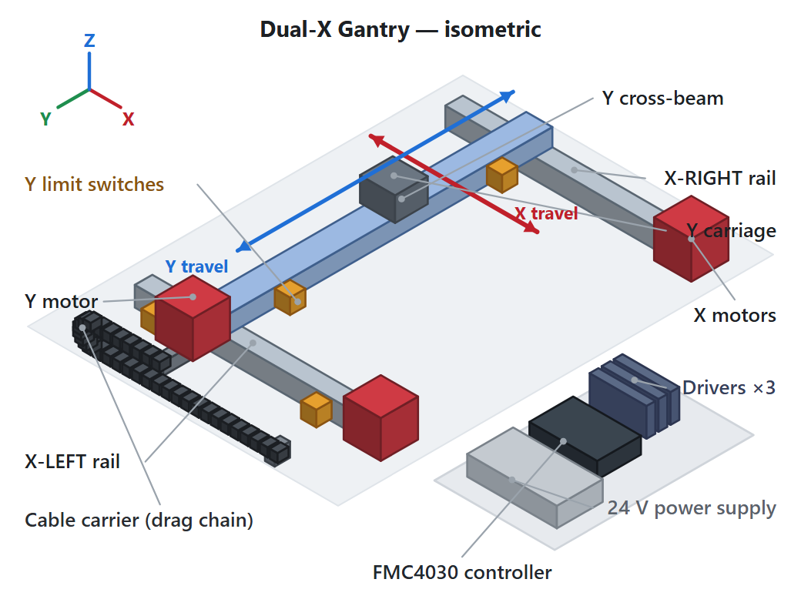

# LAU FUYU Gantry System

Documentation, wiring reference, system diagram, and control software for a **FUYU
FMC4030 dual-X gantry** — two parallel X rails driven in hardware lockstep, with a Y
cross-beam riding between them, controlled from a PC over Ethernet.



<sub>Isometric view of the system: the two X rails (driven in lockstep), the Y cross-beam
and carriage, the three motors, the FSK40 limit switches, the X-axis cable carrier (drag
chain), and the control cabinet (FMC4030 controller, three drivers, and 24 V supply).
Rendered from [`gantry_iso.svg`](gantry_iso.svg).</sub>

This repository contains three things:

| Path | What it is |
|------|------------|
| [`FUYU_FMC4030_Assembly_Wiring_Manual.html`](FUYU_FMC4030_Assembly_Wiring_Manual.html) | Self-contained assembly & wiring manual (open in any browser). The authoritative reference for build, DIP-switch, and terminal-by-terminal wiring detail. |
| [`gantry_iso.svg`](gantry_iso.svg) | Isometric diagram of the mechanical system (embedded in the manual, also usable standalone). |
| [`FuyuRailController/`](FuyuRailController/) | Qt/C++ application that drives the gantry through the FMC4030 motion controller. |

> **Not redistributed here:** vendor-supplied FUYU datasheets, the FMC4030 SDK binaries,
> controller software, and reference archives. Building `FuyuRailController` against real
> hardware needs the FMC4030 SDK DLL from FUYU — see
> [`FuyuRailController/sdk/README.txt`](FuyuRailController/sdk/README.txt).

---

## 1. System overview

This is a **dual-X gantry**. Two parallel rails — **X-Left** and **X-Right** — run in the
same direction and move together; a **Y** cross-beam spans between them and travels along
their length.

The defining design choice is in how the X axis is driven:

- Each of the three motors keeps its **own** stepper driver, but the **two X drivers share
  one controller axis** (axis 1). They receive the *same* pulse and direction signals, so
  the two rails step in **perfect hardware lockstep** and physically cannot drift out of
  sync.
- The Y beam has its own axis (axis 3).
- Because the rails share a pulse source, the gantry **cannot be squared electronically** —
  squareness is set **mechanically at assembly** and held by the rigid beam.

The **FMC4030** is a pulse-type, 3-axis motion controller built around a 32-bit ARM chip.
It generates **pulse (PU)** and **direction (DR)** signals for three external stepper
drivers, reads the axis limit/home switches, provides 4 digital inputs and 4 digital
outputs, and is commanded by a host PC over **Ethernet** (default `192.168.0.30:8088`).

### Axis mapping

| Physical axis | Controller channel | Pulse / Dir / 5 V | Limit inputs |
|---|---|---|---|
| **X-Left** (gantry rail 1) | **Axis 1** (both X drivers share this axis) | `PU1 / DR1 / 5V` | `LP1 / LN1` |
| **X-Right** (gantry rail 2) | **Axis 1** (same terminals, paralleled) | `PU1 / DR1 / 5V` | none fitted |
| **Y** (cross-beam) | Axis 3 | `PU3 / DR3 / 5V` | `LP3 / LN3` |

Axis 2 (`PU2 / DR2`, `LP2 / LN2`) is **unused** — both X drivers are fed from axis 1.
This build uses **four** limit switches: a positive/negative pair on **X-Left** and a
positive/negative pair on **Y**.

---

## 2. Hardware

### 2.1 Bill of materials

| Qty | Item | Model / spec | Role |
|---|---|---|---|
| 1 | Motion controller | **FMC4030** (3-axis) | Pulse/dir generation, limit reading, host comms |
| 3 | Stepper driver | **FMDD50D40NOM** (DC 20–50 V, 1.0–4.0 A/phase) | One each: X-Left, X-Right, Y |
| 3 | Stepper motor | **57HS056TF075A-03** (NEMA 23, 2-phase, 1.8°, 2.0 A, ≥ 80 N·cm) | X-Left rail, X-Right rail, Y beam |
| 4 | Limit / home switch | **FSK40** photoelectric, **NPN normally-open (NO)**, 5–24 V | +/− pair on X-Left, +/− pair on Y (X-Right has none) |
| 1 | DC power supply | **24 VDC**, sized ≥ 3 × motor current + margin (24 V / 10 A is a safe start) | System power; AC 100–220 V input |
| 1 | Ethernet cable | Standard RJ45 | Host communication (CN3) |
| — | Wiring | Hook-up wire, ferrules, PE ground, AC fuse/breaker | Interconnect |

### 2.2 Component specifications

**Stepper motor — 57HS056TF075A-03**: 2-phase, 1.8° ±5%, 2.0 A/phase, 1.5 VDC, 0.75 Ω,
2.7 mH, holding torque ≥ 80 N·cm, NEMA 23 (57 mm) frame, Ø8 mm shaft, 4-wire (XH-4),
0.7 kg.

**Stepper driver — FMDD50D40NOM**: 2-phase DSP driver, DC 20–50 V input, 1.0–4.0 A/phase
(8 current steps), up to 40000 microsteps/rev, max pulse rate 200 Kpps, **falling-edge
active**, auto idle-current halving after pulses stop > 1.5 s, 118 × 24.3 × 75.5 mm.

**Limit / home switch — FSK40**: photoelectric, 5–24 V, **NPN normally-open, low-level
active** (required by the FMC4030). Doubles as the **home/origin reference** for each axis.

**Controller — FMC4030**: 24 VDC power (VN+/VN−); 3 × 5 V pulse + direction outputs; 6
limit inputs (LP/LN × 3, 24 V NPN-NO); 4 digital inputs (24 V, low-active) and 4 digital
outputs (24 V open-drain, ≤ 300 mA); Ethernet (CN3), RS-232 DB9 (CN1), RS-232/485 RJ45
(CN2); default IP `192.168.0.30`, port `8088`.

### 2.3 Driver DIP-switch setup

Set the 8 DIP switches on **each** FMDD50D40NOM driver *before* wiring power.

- **SW4 = OFF** — selects pulse/subdivision mode. **Required.** `SW4 = ON` puts the driver
  in I/O mode and it will ignore the FMC4030's pulses.
- **Output current (SW1–SW3) → 2.0 A** to match the motor: `SW1 = OFF · SW2 = OFF · SW3 = ON`.
- **Microstepping (SW5–SW8) → 1600 steps/rev** (recommended start):
  `SW5 = OFF · SW6 = OFF · SW7 = ON · SW8 = ON`.

Use the **same** microstep value on all three drivers and record it — distance/speed math
depends on steps-per-rev.

### 2.4 Wiring summary

Full, terminal-by-terminal wiring (with diagrams and the complete terminal reference) is in
the **HTML manual**, §7–§12. Summary:

**Power (§7):** build a 24 V bus from the supply; feed the controller (VN+/VN−), all three
drivers (V+/V−), and the FSK40 switches from it. Mains (100–220 VAC) goes only to the
supply's L / N / earth.

**Motor → driver (§8)** — 57HS XH-4 colours map straight to coils. Coil pairing is what
matters: **A = Black + Green, B = Red + Blue**.

| Motor pin | Colour | Coil | Driver |
|---|---|---|---|
| 1 | Black | A+ | `A+` |
| 2 | Green | A− | `A−` |
| 3 | Red | B+ | `B+` |
| 4 | Blue | B− | `B−` |

Both X motors are mounted the **same way** and wired with the **same** colour map (no
`A+/A−` swap) so the shared rotation moves both carriages the same direction. X direction
is fixed **in wiring** (it can't be inverted in software because the rails share one axis);
Y direction can be inverted in wiring *or* software.

**Driver → controller (§9)** — **common-anode**: the controller's 5 V drives each driver's
`PU+`/`DR+` (tied together); the controller's `PUx`/`DRx` pins sink into `PU−`/`DR−`. The
**two X drivers are paralleled onto axis 1** (`5V`, `PU1`, `DR1`); the Y driver uses axis 3
(`5V`, `PU3`, `DR3`). Leave `MF+/MF−` open (holding torque on). Use the **5 V** rail for
`PU+/DR+`, never 24 V.

**Limit switches (§10)** — each FSK40: **Brown → 24 V+, Blue → 0 V, Black → signal**.
Positive-end switch black wire → `LP`, negative-end → `LN`. X gantry pair → `LP1 / LN1`
(axis 1); Y pair → `LP3 / LN3`. Switches **must be NPN normally-open** (inputs are
low-level active).

**Digital I/O & comms (§11):** 4 inputs `IN0–IN3` (24 V active-low); 4 open-drain outputs
`OP1–OP4` (sink ≤ 300 mA, wire load between 24 V+ and the output). Host link is Ethernet on
**CN3**; set the PC adapter to the controller's subnet (e.g. `192.168.0.35 / 255.255.255.0`)
and verify with `ping 192.168.0.30`.

### 2.5 Mechanical & safety notes

- **Square the gantry mechanically:** set the two X rails truly parallel and equal-length,
  mount the Y beam perpendicular (equal diagonals), and start both X carriages at the same
  position before fixing the beam. The controller can't correct rail-to-rail squareness.
- **Mount both X motors identically** (same orientation, same end) so shared rotation =
  same travel. The §14 jog test confirms it: nudge axis 1 — both rails should move together.
- Position the **negative-end** switch at the home/zero end and the **positive-end** switch
  at the far end of each axis, with margin before the hard stop. X-Right has no over-travel
  switch, so set conservative soft-travel limits in software.
- Keep ≥ 50 mm between side-by-side drivers (thermal shutdown at 80 °C); keep AC mains wiring
  separated from low-voltage signal/Ethernet wiring.
- ⚠ **The supply primary side carries 100–220 VAC.** Wire everything de-energized with the
  AC plug removed; bond the controller `PE` and frame to protective earth; don't plug/unplug
  a motor while its driver is powered.

---

## 3. Software — `FuyuRailController`

A small **Qt Widgets** application for driving the FMC4030. Its defining choice: it
**reuses the Velmex widget classes** from `LAU3DVideoRecorder` *verbatim* and only **swaps
the controller** — `LAUVelmexController` is reimplemented to talk to the FMC4030 over
Ethernet instead of a serial Velmex VXM. You get the proven Velmex control panel driven by
FUYU hardware.

### 3.1 Build & run

Verified to build clean with **Qt 6.9.3, MSVC 2022 (64-bit)**.

**Simulation (default — no hardware or SDK needed):**

```sh
qmake
nmake            # Windows/MSVC   (or make / jom)
./FuyuRailController
```

A built-in simulator eases each axis toward its commanded target and emulates the limit
switches, so the entire UI is exercisable with nothing plugged in. In Qt Creator: open
`FuyuRailController.pro`, pick the Qt 6 / MSVC 2022 kit, Build & Run.

**Real hardware:**

```sh
qmake CONFIG+=hardware
nmake
```

The vendor library is loaded **at run time** via `QLibrary`, so the build needs **no `.lib`
and no `.h`** — and it launches even with no SDK present (reporting *disconnected*). Place
`FMC4030-Dll.dll` (Windows, 64-bit) next to the `.exe` or on `PATH`, or `libFMC4030-Lib.so`
on the Linux library path; bitness must match the build. The `.pro` auto-copies
`sdk/FMC4030-Dll.dll` next to the built executable on Windows.

The controller defaults to **`192.168.0.30:8088`**; put your PC adapter on the same subnet.

### 3.2 Axis mapping in software

The FMC4030 SDK numbers axes `0 = X (PU1)`, `1 = Y (PU2)`, `2 = Z (PU3)`. On this gantry the
shared-X / separate-Y layout maps as:

| App axis | SDK index | Physical |
|---|---|---|
| X gantry | 0 | both X rails (shared signal) |
| (unused) | 1 | — |
| Y beam | 2 | cross-beam carriage |

`main.cpp` builds the panel with `LAUMultiVelmexWidget({0, 2})` — one checkable group box
per axis, each with Left-Limit / Slider-Position / Right-Limit rows and Calibrate / Center /
Scan buttons, plus a `?` settings dialog.

### 3.3 How it works

- **Units:** the widgets speak integer "counts"; here **1 count = 1 µm** (0.001 mm). The
  controller converts counts ↔ millimetres at the SDK boundary; the display shows **mm**
  (default) or **inches**, switchable in the `?` dialog (the **Speed** field follows the
  unit). The unit choice is shared by all axes.
- **Motion is non-blocking.** A move issues `FMC4030_Jog_Single_Axis` once; a 500 ms timer
  polls `FMC4030_Check_Axis_Is_Stop` until the axis settles, so position stays live and a
  Stop can be processed mid-move. The position slider is a *setpoint* (Center/Scan jump
  straight to it).
- **Calibration discovers travel from the limit switches**, like Velmex: `calibrateLeft()`
  homes the negative switch (sets zero); `calibrateRight()` seeks the positive switch (sets
  travel, bounded to a 2000 mm safety ceiling if a switch is missing). The slider range then
  reflects real travel.
- **Settings dialog (`?`):** Units · Home Toward · Speed · Scan Steps. The Velmex-specific
  mechanical fields were removed because the FMC4030 abstracts them away.

### 3.4 Blocking vs non-blocking SDK (important)

FUYU ships **two** builds of the DLL — *blocking* and *non-blocking* — with identical
function names but different behaviour. **This project requires the non-blocking X64 build**,
because the controller is poll-based (one jog, then poll is-stopped). With the blocking DLL,
a motion call doesn't return until the move finishes — you lose live position feedback and
the ability to abort mid-move, which is a safety concern on a gantry. See
[`FuyuRailController/sdk/README.txt`](FuyuRailController/sdk/README.txt).

### 3.5 Source layout

| File | Purpose |
|---|---|
| `lauvelmexwidget.h` / `.cpp` | Velmex widget classes (verbatim) **+** the FMC4030-backed `LAUVelmexController` and trimmed `LAUVelmexSettingsDialog` |
| `main.cpp` | Builds `LAUMultiVelmexWidget({0, 2})` |
| `FuyuRailController.pro` | qmake project; selects simulation vs hardware |
| `sdk/` | Holds the non-blocking X64 `FMC4030-Dll.dll` (not committed) + `README.txt` |

---

## 4. Repository layout

```
.
├── FUYU_FMC4030_Assembly_Wiring_Manual.html   # assembly & wiring manual
├── gantry_iso.svg                             # isometric system diagram
├── README.md                                  # this file
└── FuyuRailController/                         # Qt/C++ controller app
    ├── FuyuRailController.pro
    ├── main.cpp
    ├── lauvelmexwidget.h / .cpp
    └── sdk/README.txt
```

---

## 5. Credits & license

© 2026 Dr. Daniel L. Lau. The control application reuses the `LAU3DVideoRecorder` Velmex
module. FUYU, FMC4030, and the component model numbers are trademarks/products of their
respective owners; their proprietary datasheets and SDK binaries are not redistributed here.
